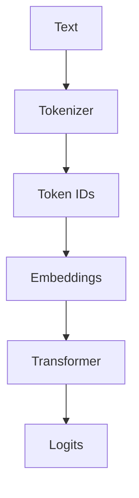

# AI-DeepDive — Build a LearnCpp-Style AI/LLM Learning Platform

## 0. YOUR ROLE

You are an expert:

* educational platform architect
* technical writer
* Python/ML/LLM engineer
* documentation engineer
* frontend engineer
* UX designer
* information architect

Your task is to build a **local-first, self-hosted educational website called `AI-DeepDive`**.

This is NOT merely a Markdown viewer.

This is NOT a generic documentation site.

This is NOT a blog.

This is NOT an AI-generated notes dump.

The goal is to build a **LearnCpp-style structured learning platform for Python, Machine Learning, NLP, Transformers, LLMs, Information Retrieval, RAG, Agents, and Production AI**.

The experience should feel like:

> “I am following a serious textbook/course website chapter by chapter.”

The user should be able to start from Chapter 1 and progressively reach research-level AI systems.

---

# 1. CORE PHILOSOPHY

The central educational philosophy is:

> **Concept → Why it exists → Mental model → Internals → From-scratch implementation → Real implementation → Experiment → Common mistakes → Performance → Debugging → Interview questions → AI connection → Mini project**

Do NOT teach frameworks before the underlying concepts.

For example:

Do NOT begin with:

```python
retriever.invoke(query)
```

and explain only the API.

Instead teach:

```text
Python object
    ↓
method dispatch
    ↓
Retriever abstraction
    ↓
query processing
    ↓
embedding model
    ↓
vector representation
    ↓
similarity function
    ↓
ANN index
    ↓
candidate retrieval
    ↓
metadata filtering
    ↓
Document objects
    ↓
Python list
```

The user should understand what is happening **underneath the abstraction**.

---

# 2. IMPORTANT DESIGN PRINCIPLE

Use LearnCpp as **structural inspiration only**.

Do NOT copy:

* their branding
* their source code
* their exact visual design
* their text
* their logos
* their content

Instead reproduce the educational characteristics:

* chapter hierarchy
* small lessons
* sequential learning
* previous/next navigation
* chapter summaries
* quizzes
* exercises
* practical examples
* cross references
* glossary/reference style
* clear typography
* persistent navigation
* progress through lessons

---

# 3. SOURCE OF TRUTH

The attached syllabus is the initial source of truth.

Preserve the overall:

* 10-part structure
* 60-chapter progression
* chapter titles
* chapter ordering
* conceptual progression

The syllabus progresses approximately as:

```text
PART I
Python

PART II
Scientific Python

PART III
ML & NLP

PART IV
Transformers & LLMs

PART V
Information Retrieval

PART VI
RAG

PART VII
LLM Application Frameworks

PART VIII
Agents

PART IX
Production AI

PART X
Evaluation & Research
```

Do not randomly reorder chapters.

Do not collapse everything into broad pages.

Do not turn all 60 chapters into one giant document.

The chapter structure is intentionally granular.

---

# 4. TARGET ARCHITECTURE

Build a static/local-first site.

Preferred stack:

* React
* TypeScript
* Vite or equivalent modern local development setup
* Tailwind CSS or another maintainable utility/component styling system
* Markdown or MDX for lesson content
* local JSON/TS metadata for navigation and progress
* client-side search
* localStorage for progress/bookmarks/settings

Avoid unnecessary backend infrastructure.

The first version should work completely locally.

The command should be approximately:

```bash
npm install
npm run dev
```

and then:

```text
http://localhost:xxxx
```

The exact port can be chosen automatically.

---

# 5. FILE/DIRECTORY ARCHITECTURE

The learning content must be **separate from the application code**.

Use a structure similar to:

```text
ai-deepdive/
│
├── app/
│   ├── src/
│   │   ├── components/
│   │   ├── pages/
│   │   ├── layouts/
│   │   ├── hooks/
│   │   ├── utils/
│   │   ├── search/
│   │   └── styles/
│   │
│   └── ...
│
├── content/
│   │
│   ├── part-01-python/
│   │   ├── chapter-01-how-python-works/
│   │   │   ├── index.md
│   │   │   ├── 01-python-programs.md
│   │   │   ├── 02-running-python.md
│   │   │   ├── 03-python-implementations.md
│   │   │   ├── 04-python-path.md
│   │   │   ├── 05-inspecting-python.md
│   │   │   ├── exercises.md
│   │   │   ├── summary.md
│   │   │   └── quiz.md
│   │   │
│   │   ├── chapter-02-objects-memory/
│   │   ├── chapter-03-numbers-strings-booleans/
│   │   └── ...
│   │
│   ├── part-02-scientific-python/
│   ├── part-03-ml-nlp/
│   ├── part-04-transformers-llms/
│   ├── part-05-information-retrieval/
│   ├── part-06-rag/
│   ├── part-07-frameworks/
│   ├── part-08-agents/
│   ├── part-09-production/
│   └── part-10-evaluation-research/
│
├── data/
│   ├── curriculum.json
│   ├── glossary.json
│   ├── references.json
│   └── exercises.json
│
├── scripts/
│   ├── build-search-index.*
│   ├── validate-content.*
│   └── generate-navigation.*
│
├── README.md
└── package.json
```

Every lesson should exist as a **real separate source file**.

Do NOT hardcode all educational content inside React components.

---

# 6. CURRICULUM DATA MODEL

Create a machine-readable curriculum definition.

Example:

```json
{
  "parts": [
    {
      "id": "part-01",
      "number": 1,
      "title": "Python, Properly",
      "chapters": [
        {
          "id": "chapter-01",
          "number": "1",
          "title": "How Python Actually Works",
          "slug": "how-python-actually-works",
          "lessons": [
            {
              "id": "1.1",
              "title": "Python Programs",
              "file": "01-python-programs.md"
            },
            {
              "id": "1.2",
              "title": "Running Python",
              "file": "02-running-python.md"
            }
          ]
        }
      ]
    }
  ]
}
```

The UI should be generated from this structure.

This allows:

* automatic sidebar generation
* breadcrumb generation
* next/previous navigation
* progress calculation
* search indexing
* future expansion

---

# 7. WEBSITE INFORMATION ARCHITECTURE

Create these major pages:

## `/`

Landing page

Include:

* AI-DeepDive title
* tagline
* short explanation
* curriculum overview
* “Start Learning” button
* current progress
* featured chapters
* learning philosophy
* roadmap visualization

Suggested tagline:

> **Understand the systems behind modern AI.**

Secondary line:

> Python → ML → NLP → Transformers → LLMs → Retrieval → RAG → Agents → Production → Research

---

## `/curriculum`

Complete curriculum.

Display:

```text
Part I — Python, Properly
    Chapter 1 — How Python Actually Works
       1.1 Python Programs
       1.2 Running Python
       ...
    Chapter 2 — Variables, Objects & Memory
       ...
```

The curriculum must be expandable/collapsible.

Show:

* completed lessons
* current lesson
* locked/unlocked if future gating is enabled
* chapter progress

---

## `/part/:part`

Part overview.

Display:

* part description
* why this part matters
* chapters
* expected prerequisites
* estimated study time

---

## `/chapter/:chapter`

Chapter landing page.

Display:

* chapter title
* description
* learning objectives
* prerequisites
* lesson list
* chapter project
* quiz
* progress

---

## `/lesson/:lesson`

Main lesson page.

This is the primary learning interface.

---

# 8. LESSON PAGE DESIGN

The lesson screen should feel like a serious technical textbook.

Recommended layout:

```text
┌────────────────────────────────────────────────────┐
│ AI-DeepDive                              Search 🔎 │
├──────────────┬────────────────────────┬────────────┤
│ Curriculum   │        LESSON          │ On this    │
│              │                        │ page       │
│ Part I       │ Chapter 2              │            │
│  Chapter 1   │ Variables & Objects   │ • Concept  │
│  Chapter 2   │                        │ • Memory   │
│  Chapter 3   │ lesson content        │ • Example  │
│              │                        │ • Exercise │
│              │                        │            │
├──────────────┴────────────────────────┴────────────┤
│ Previous lesson                     Next lesson →  │
└────────────────────────────────────────────────────┘
```

Desktop:

* left sidebar: curriculum navigation
* center: content
* right: table of contents

Mobile:

* sidebar becomes drawer
* right ToC becomes collapsible

---

# 9. LESSON CONTENT TEMPLATE

Every lesson should follow a standard structure where relevant.

Each Markdown/MDX lesson should have frontmatter:

```yaml
---
id: "2.1"
part: 1
chapter: 2
title: "What Is a Variable?"
slug: "what-is-a-variable"
difficulty: "beginner"
estimated_minutes: 20
prerequisites:
  - "1.1"
tags:
  - python
  - objects
  - memory
---
```

Then structure content as:

# Concept

What is this?

# Why does it exist?

What problem does it solve?

# Mental model

Visual explanation.

# Under the hood

Explain internals.

# Example

Small example.

# Step-by-step

Explain execution line by line.

# Experiment

Ask the learner to change something.

# Common mistakes

Show common incorrect assumptions.

# Performance

Discuss:

* time
* space
* memory
* CPU/GPU when applicable

# Debugging

Show how to inspect what is happening.

# AI connection

Explain why this matters later.

# Exercise

A concrete task.

# Further reading

Official docs / papers / references.

Not every section must be forced into every lesson.

Use judgment.

---

# 10. EDUCATIONAL DEPTH REQUIREMENT

This is critical.

The content must be **deep**, not superficial.

For example, for:

```python
a = [1, 2, 3]
b = a
```

Do not simply say:

> b references a.

Explain:

```text
variable binding
      ↓
object reference
      ↓
list object
      ↓
list storage
      ↓
element references
```

Then show:

```python
b.append(4)
```

and explain exactly why `a` changes.

Then contrast:

```python
b = a.copy()
```

and:

```python
copy.deepcopy(a)
```

Then discuss:

* aliasing
* object identity
* mutability
* shallow copy
* deep copy
* memory implications

This is the expected standard throughout the curriculum.

---

# 11. CODE EXAMPLES

Code examples must be:

* executable
* minimal
* readable
* correctly formatted
* progressively complex

Use syntax highlighting.

Support:

* Python
* Bash
* JSON
* YAML
* SQL
* JavaScript/TypeScript
* mathematical pseudocode

where needed.

Every meaningful code example should be accompanied by an explanation.

Do not have huge unexplained code blocks.

---

# 12. INTERACTIVE CODE FEATURES

Where feasible, add:

### Copy button

Every code block gets:

```text
Copy
```

### Run button

For Python examples where safe.

Prefer a client-side sandbox if practical.

Do NOT make the platform dependent on a remote execution service for basic examples.

### Output panel

Example:

```text
Output

140735...
```

### Explain button

Optional future feature.

---

# 13. DIAGRAMS

This platform must be visually educational.

Use diagrams for:

* memory
* Python object references
* call stack
* hash tables
* NumPy memory
* tensors
* computational graphs
* attention
* transformers
* embeddings
* vector search
* HNSW
* RAG pipelines
* agents

Prefer Mermaid or lightweight SVG for conceptual diagrams.

Example:



Do not turn the site into an image-heavy presentation.

Diagrams should clarify concepts.

---

# 14. MATHEMATICS

Math must render beautifully.

Support LaTeX.

Use:

```text
KaTeX or MathJax
```

For example:

[
Attention(Q,K,V)
================

softmax
\left(
\frac{QK^T}{\sqrt{d_k}}
\right)V
]

For mathematical chapters:

* explain notation
* explain intuition
* derive equations
* give numerical examples
* connect equations to code

Never drop an equation without explanation.

---

# 15. QUIZZES

Every chapter needs a quiz.

Inspired by the chapter-summary/quiz pattern used by LearnCpp.

Create:

```text
Chapter 6 Quiz
```

with approximately:

* 5–10 questions
* conceptual questions
* output prediction
* debugging
* “what happens internally?”
* complexity questions
* occasional multiple choice
* occasional free-response

Example:

```text
What does `a is b` test?

A. Equality
B. Identity
C. Hash equality
D. Type equality
```

After answering:

* show correctness
* explain why
* optionally reveal a deeper explanation

Store quiz progress locally.

---

# 16. CHAPTER SUMMARY

Every chapter must have:

```text
What you learned
Key concepts
Important APIs
Mental models
Common traps
Interview takeaways
```

Also include:

```text
Before moving on
```

with 3–7 checks.

Example:

```text
□ I can explain identity vs equality.
□ I understand mutability.
□ I can explain aliasing.
□ I understand shallow vs deep copy.
```

---

# 17. EXERCISES

Exercises should have difficulty levels:

```text
🟢 Basic
🟡 Intermediate
🔴 Advanced
```

Examples:

### Basic

Predict output.

### Intermediate

Debug broken code.

### Advanced

Implement a simplified version yourself.

Exercises must be stored separately when useful.

Example:

```text
chapter-06/
    exercises.md
    exercise-01-hash-function.md
    exercise-02-hash-table.md
```

---

# 18. MINI PROJECTS

Every chapter or major group should culminate in a small project.

Examples:

### Chapter 2

Python memory playground

### Chapter 6

Build a hash table

### Chapter 9

Streaming data processor

### Chapter 15

NumPy-style tensor playground

### Chapter 18

Manual autograd engine

### Chapter 25

Implement self-attention from scratch

### Chapter 35

Build brute-force vector search

### Chapter 36

Implement a simplified ANN index

### Chapter 37

Build minimal RAG from scratch

### Chapter 42

Build a reranking pipeline

### Chapter 45

Build a RAG evaluation harness

### Chapter 50

Build a tool-using agent

### Chapter 56

Design a production RAG architecture

These should force understanding, not just API usage.

---

# 19. PROGRESS TRACKING

Use localStorage.

Track:

```text
lesson completed
quiz completed
exercise attempted
bookmark
last visited lesson
```

Homepage should display:

```text
Your progress

Part I     ███████░░░ 70%
Part II    ███░░░░░░░ 30%
Overall    ████░░░░░░ 40%
```

Also show:

```text
Continue Learning
Chapter 6 → 6.4 Hash Collisions
```

No login required.

---

# 20. BOOKMARKS

Allow:

```text
Bookmark lesson
Bookmark section
```

Create a dedicated:

```text
/bookmarks
```

page.

Store locally.

---

# 21. SEARCH

Implement global client-side search.

Search across:

* lesson titles
* headings
* body text
* code concepts
* tags
* glossary

Search should return:

```text
Search: "reference counting"

Chapter 2
2.7 Reference Counting

Chapter 2
2.9 Circular References

Chapter 12
Python Data Model
```

Use a lightweight local search engine such as:

* MiniSearch
* FlexSearch
* Fuse.js

Avoid external search APIs.

Add keyboard shortcut:

```text
Ctrl/Cmd + K
```

---

# 22. GLOBAL GLOSSARY

Create:

```text
/glossary
```

Terms such as:

* object identity
* mutability
* hashability
* gradient
* tensor
* embedding
* tokenizer
* attention
* logits
* reranker
* ANN
* HNSW
* RAG
* grounding
* agent
* KV cache

Each glossary entry should contain:

```text
Definition
Simple explanation
Technical explanation
Where it appears in the curriculum
```

Cross-link terms automatically.

---

# 23. CROSS REFERENCES

When a lesson mentions a concept already covered:

```text
See also:
Chapter 2 — Object Identity
Chapter 6 — Hashability
```

Make these clickable.

Future concepts can display:

```text
Coming later:
Chapter 35 — Vector Search
```

This creates a connected knowledge graph.

---

# 24. LEARNING PREREQUISITES

Every chapter should declare prerequisites.

Example:

```text
Chapter 25 — Attention

Prerequisites:
✓ Chapter 17 — PyTorch
✓ Chapter 20 — Linear Algebra
✓ Chapter 23 — Tokenization
✓ Chapter 24 — Embeddings
```

If prerequisites are incomplete, do not block the learner, but show a warning.

---

# 25. DIFFICULTY

Every lesson should have:

```text
Beginner
Intermediate
Advanced
Research
```

Use this for filtering.

---

# 26. ESTIMATED TIME

Each lesson should include:

```text
~20 min
```

Each chapter should include:

```text
Estimated chapter time: 2h 15m
```

Do not make unrealistic estimates.

---

# 27. DARK MODE

Support:

* light mode
* dark mode
* system mode

Code blocks should remain highly readable in both.

---

# 28. TYPOGRAPHY / VISUAL STYLE

The website should feel:

* technical
* serious
* calm
* academic
* modern
* minimal
* highly readable

Avoid:

* flashy gradients
* excessive animations
* AI-dashboard aesthetics
* giant hero graphics
* excessive rounded cards
* unnecessary glassmorphism

The content is the star.

Think:

```text
technical textbook
+
modern documentation
+
excellent educational UX
```

---

# 29. NAVIGATION

Persistent navigation should include:

```text
Home
Curriculum
Search
Glossary
Bookmarks
Progress
```

Each lesson should have:

```text
← Previous
Next →
```

Also:

```text
Part I / Chapter 2 / Lesson 2.4
```

breadcrumb.

---

# 30. CHAPTER NAVIGATION

For each chapter:

```text
Chapter 6 — Dictionaries & Hash Tables

6.1 Dictionary
6.2 Hash Functions
6.3 Hashability
6.4 Hash Collisions
6.5 Buckets
6.6 Load Factor
6.7 Resizing
6.8 Dictionary Lookup
6.9 Sets
6.10 Complexity
6.x Chapter Summary
6.y Chapter Quiz
6.z Chapter Project
```

Make this feel like a textbook table of contents.

---

# 31. LESSON NUMBERING

Use stable numbering.

Format:

```text
1.1
1.2
1.3

2.1
2.2

...

60.x
```

Do NOT use random IDs in the visible UI.

The numbering must remain stable even if files are reorganized.

---

# 32. CONTENT FILE CONVENTION

Each lesson file should be self-contained.

Example:

```text
content/
└── part-01-python/
    └── chapter-02-objects-memory/
        ├── index.md
        ├── 2.1-what-is-a-variable.md
        ├── 2.2-objects.md
        ├── 2.3-id.md
        ├── 2.4-is-vs-equals.md
        ├── 2.5-references.md
        ├── 2.6-mutability.md
        ├── 2.7-reference-counting.md
        ├── 2.8-garbage-collection.md
        ├── 2.9-circular-references.md
        ├── 2.10-memory-leaks.md
        ├── summary.md
        ├── quiz.md
        └── project.md
```

---

# 33. CONTENT QUALITY STANDARD

This is the most important requirement.

Do NOT generate shallow content like:

> “A dictionary is a collection of key-value pairs.”

That is insufficient.

Instead:

1. Explain the concept.
2. Build intuition.
3. Show a minimal example.
4. Show a counterexample.
5. Explain the internal model.
6. Discuss complexity.
7. Show the actual Python API.
8. Demonstrate edge cases.
9. Explain how to inspect it.
10. Connect it to AI systems.

The standard should be closer to:

```text
high-quality technical textbook
```

than:

```text
blog post
```

---

# 34. "FROM SCRATCH FIRST" POLICY

Whenever reasonable, implement simplified versions first.

Examples:

### Hash table

Build:

```text
SimpleHashTable
```

before showing Python `dict`.

### Vector search

Build:

```python
for vector in database:
    score = cosine_similarity(query, vector)
```

before FAISS.

### Autograd

Build a tiny scalar autograd engine before PyTorch autograd.

### Attention

Implement matrix operations manually before calling a Transformer library.

### RAG

Build:

```text
documents
→ chunks
→ embeddings
→ cosine similarity
→ top-k
→ prompt
→ LLM
```

before LangChain.

This is one of the defining characteristics of the platform.

---

# 35. REAL LIBRARY SECOND

After the from-scratch implementation, show the production ecosystem.

Examples:

```text
Python internals
   ↓
NumPy
   ↓
PyTorch
   ↓
Transformers
   ↓
FAISS
   ↓
LangChain/LlamaIndex
```

Always explain:

> “What abstraction does this library provide over the thing we just implemented?”

---

# 36. EXPERIMENT-FIRST LEARNING

Every major concept should have experiments.

Example:

```python
a = [1, 2, 3]
b = a

print(a is b)

b.append(4)

print(a)
```

Then ask:

> Predict the output before running.

This should become a recurring pattern.

---

# 37. DEBUGGING AS A FIRST-CLASS SKILL

Do not only show correct code.

Create intentionally broken examples.

Example:

```python
def get_embedding(text):
    return model.encode(text)

embeddings = get_embedding(texts)
```

Then demonstrate:

* error
* traceback
* diagnosis
* fix
* why the mistake happened

Build the learner's debugging intuition.

---

# 38. PERFORMANCE

Every concept that affects performance should discuss:

```text
Time Complexity
Space Complexity
Memory
CPU
GPU
Latency
Throughput
```

For LLM topics additionally:

```text
Tokens/sec
VRAM
Batch size
Context length
Inference cost
```

---

# 39. RESEARCH CONNECTIONS

Advanced chapters should include:

```text
Why this matters for research
```

For example:

HNSW →

```text
retrieval quality
vs
search latency
vs
memory
```

Attention →

```text
O(n²)
```

then discuss why long-context architectures exist.

RAG →

```text
retrieval bottleneck
context bottleneck
generation bottleneck
```

Do not oversimplify research topics.

---

# 40. AI-DEEPDIVE ROADMAP

Use exactly this high-level curriculum:

## PART I — Python, Properly

1. How Python Actually Works
2. Variables, Objects & Memory
3. Numbers, Strings & Booleans
4. Lists
5. Tuples
6. Dictionaries & Hash Tables
7. Functions & Call Stack
8. Scope, Closures & Decorators
9. Iterators & Generators
10. Object-Oriented Python
11. Python Data Model
12. Exceptions & Debugging
13. Modules, Packages & Environments
14. Type Systems & Data Validation

## PART II — Scientific Python

15. NumPy Internals
16. Pandas
17. PyTorch Fundamentals
18. Autograd & Computational Graphs

## PART III — ML & NLP

19. Machine Learning Foundations
20. Mathematics for ML
21. Neural Networks
22. Traditional NLP

## PART IV — Transformers & LLMs

23. Tokenization
24. Embeddings
25. Attention
26. Transformer Architecture
27. GPT / Decoder-Only LLMs
28. LLM Training
29. LLM Inference
30. Hugging Face Transformers
31. Fine-Tuning
32. LLM Optimization

## PART V — Information Retrieval

33. Search Engines
34. BM25
35. Vector Search
36. ANN Algorithms

## PART VI — RAG

37. RAG Fundamentals
38. Document Ingestion
39. Chunking
40. Embedding + Indexing Pipeline
41. Retrieval
42. Reranking
43. Advanced RAG
44. GraphRAG
45. RAG Evaluation

## PART VII — LLM Application Frameworks

46. LangChain Fundamentals
47. LangChain Internals
48. LlamaIndex

## PART VIII — Agents

49. Tool Calling
50. Agents
51. Multi-Agent Systems

## PART IX — Production AI

52. APIs
53. FastAPI
54. LLM Serving
55. Docker & Deployment
56. AI System Design

## PART X — Evaluation & Research

57. LLM Evaluation
58. RAG Evaluation
59. LLM Safety
60. Research-Level LLM Systems

---

# 41. DO NOT STOP AT THE 60 CHAPTER TITLES

Create the infrastructure so chapters can contain many lessons.

The 60 chapters are the macro curriculum.

Within each chapter, generate logical sub-lessons.

For example:

```text
Chapter 25 — Attention

25.1 Why Attention?
25.2 Query, Key, Value
25.3 Dot-Product Similarity
25.4 Scaling by sqrt(d_k)
25.5 Softmax
25.6 Single-Head Self-Attention
25.7 Causal Masking
25.8 Multi-Head Attention
25.9 Cross-Attention
25.10 Implementing Attention in NumPy
25.11 Implementing Attention in PyTorch
25.12 Attention Complexity
25.x Summary
25.y Quiz
25.z Project
```

This is the level of granularity wanted.

---

# 42. CONTENT GENERATION STRATEGY

Do NOT attempt to hallucinate 60 chapters of perfect content in a single giant generation step.

Instead:

### Phase 1

Build the complete website.

### Phase 2

Create curriculum metadata.

### Phase 3

Create all directories/files.

### Phase 4

Fully write Chapters 1–3.

### Phase 5

Create the reusable lesson template.

### Phase 6

Generate the remaining chapter structures using the same schema.

### Phase 7

Populate chapters progressively.

This avoids low-quality repetitive content.

The application should support incomplete chapters gracefully.

For unfinished chapters show:

```text
This chapter is under construction.
```

but the navigation should already exist.

---

# 43. CONTENT STATUS

Each chapter and lesson should support:

```text
draft
review
published
under-construction
```

Example:

```yaml
status: published
```

This lets the curriculum evolve without breaking navigation.

---

# 44. CONTENT VALIDATION

Create a validation script.

For every lesson verify:

* unique ID
* valid chapter
* valid frontmatter
* valid links
* valid previous lesson
* valid next lesson
* code fence closure
* no broken references

Run:

```bash
npm run validate-content
```

before build.

---

# 45. AUTOMATIC NAVIGATION

Do not manually hardcode:

```text
Previous lesson
Next lesson
```

Generate it from curriculum metadata.

If lesson order is:

```text
2.4
2.5
2.6
```

then navigation should automatically know:

```text
Previous → 2.4
Next → 2.6
```

---

# 46. RESPONSIVE DESIGN

Must work well on:

### Desktop

Primary experience.

### Laptop

Excellent.

### Tablet

Good.

### Mobile

Readable and usable.

Do not simply shrink the desktop UI.

---

# 47. ACCESSIBILITY

Support:

* keyboard navigation
* semantic HTML
* proper heading hierarchy
* focus states
* sufficient contrast
* accessible buttons
* alt text
* reduced motion

---

# 48. PERFORMANCE

The site should remain fast even with hundreds/thousands of lessons.

Do not load every lesson body on the homepage.

Use:

* code splitting
* lazy loading
* generated search index
* efficient Markdown parsing
* static assets
* optimized bundles

---

# 49. OFFLINE-FIRST

The user should be able to run the platform locally without internet after dependencies are installed.

Educational content should remain available without external APIs.

Official docs links can point externally, but the core lessons must be local.

---

# 50. OPTIONAL PWA

If simple to implement, make the site installable as a PWA.

Then the user can:

```text
Install AI-DeepDive
      ↓
Desktop app-like experience
      ↓
Offline reading
```

Do not compromise the core architecture for this.

---

# 51. SEARCH INDEX

Build the search index from Markdown content.

Each search result should include:

```text
Title
Chapter
Part
Matching excerpt
Tags
```

Click → exact lesson.

Highlight matched terms.

---

# 52. GLOSSARY AUTOLINKING

When a glossary term appears in content, optionally render it as:

```text
embedding
```

with tooltip:

```text
A dense numerical representation of data in vector space...
```

Do not over-link every occurrence.

---

# 53. COMMAND PALETTE

Implement a command palette:

```text
Cmd/Ctrl + K
```

Actions:

```text
Search lessons
Go to curriculum
Go to glossary
Continue learning
Toggle dark mode
Open bookmarks
```

This will make the site feel like a serious technical tool.

---

# 54. "LEARNING MODE"

Add a simple toggle:

```text
Learning Mode
```

When enabled:

* hides unnecessary UI
* increases reading width
* keeps chapter navigation minimal
* focuses attention on the lesson

---

# 55. "REFERENCE MODE"

Add another mode:

```text
Reference Mode
```

Optimized for quickly finding:

* APIs
* definitions
* formulas
* complexity
* code examples
* glossary terms

This distinction is valuable because learning and lookup are different workflows.

---

# 56. CHAPTER DASHBOARD

Every chapter landing page should visually show:

```text
Chapter 6
Dictionaries & Hash Tables

Progress       ██████░░░ 60%

Lessons        10
Completed      6
Exercises      8
Quiz           Not attempted
Project        Not started

Estimated time: 2h 30m
Difficulty: Intermediate
Prerequisites: Chapter 2, Chapter 3
```

---

# 57. "CONTINUE LEARNING"

Homepage should remember the last lesson.

Example:

```text
Continue Learning

6.4 Hash Collisions

Chapter 6 — Dictionaries & Hash Tables

Continue →
```

---

# 58. NOTES

Allow local notes attached to lessons.

Example:

```text
My Notes

"Important: tuple immutability does not necessarily mean deep immutability."
```

Use localStorage or IndexedDB.

No login needed.

---

# 59. BOOKMARK / HIGHLIGHT

Allow:

```text
Bookmark
```

and optionally text highlights.

Do not make this overly complex in the first implementation.

---

# 60. REFERENCES

Each chapter should have a references section.

Prefer:

1. Official documentation
2. Original papers
3. High-quality technical resources
4. Library documentation
5. Standards/specifications where relevant

Do NOT fill references with low-quality SEO blogs.

For current libraries, verify documentation links before publishing.

---

# 61. CODE QUALITY

The generated project must be maintainable.

Use:

* TypeScript
* modular components
* reusable layouts
* typed curriculum schema
* reusable Markdown renderer
* reusable code blocks
* reusable quiz components

Avoid:

* giant monolithic components
* duplicated lesson rendering logic
* hardcoded navigation
* repeated styles
* unnecessary dependencies

---

# 62. README

Create a complete README explaining:

```text
What is AI-DeepDive?
How to install
How to run
How to add a chapter
How to add a lesson
How to add a quiz
How progress is stored
How search works
How to validate content
How to build production version
```

Include contribution/content authoring instructions.

---

# 63. CONTENT AUTHORING GUIDE

Create:

```text
content/AUTHORING.md
```

Explain:

```text
How to create a chapter
How to create a lesson
Frontmatter
Code blocks
Math
Mermaid
Quiz format
Exercises
References
Cross-links
Tags
Difficulty
Estimated time
```

A future user should be able to add:

```text
Chapter 61
```

without touching frontend code.

---

# 64. TESTING

Add tests for:

* curriculum parsing
* lesson routing
* search
* progress storage
* quiz scoring
* broken links
* content validation

At minimum, ensure the site builds successfully.

---

# 65. VISUAL QUALITY BAR

Do not settle for:

```text
basic sidebar
white background
Markdown text
```

The site should feel deliberately designed.

But also do not over-design it.

Desired aesthetic:

```text
Linear
+
Stripe Docs
+
LearnCpp
+
technical textbook
```

with a strong emphasis on readability.

---

# 66. FUTURE EXTENSIBILITY

Architect the system so the following can later be added:

* Python playground
* browser-based Jupyter-like execution
* spaced repetition
* flashcards
* adaptive quizzes
* AI tutor
* semantic search
* generated concept maps
* chapter certificates
* coding challenges
* interactive tensor visualizations
* attention visualizer
* embedding explorer
* vector search visualizer
* RAG playground

Do NOT implement all of these now.

Build a solid foundation for them.

---

# 67. FIRST IMPLEMENTATION PRIORITY

Build in this order:

## Step 1

Project scaffold

## Step 2

Curriculum schema

## Step 3

Routing

## Step 4

Sidebar navigation

## Step 5

Markdown/MDX renderer

## Step 6

Chapter/lesson layouts

## Step 7

Search

## Step 8

Progress

## Step 9

Quizzes

## Step 10

Glossary

## Step 11

Bookmarks

## Step 12

Dark/light mode

## Step 13

Content validation

## Step 14

Write high-quality initial content

---

# 68. INITIAL CONTENT TO WRITE

Fully implement:

```text
Chapter 1
Chapter 2
Chapter 3
```

with genuinely deep lessons.

Chapter 2 in particular must cover:

```text
2.1 What Is a Variable?
2.2 Objects
2.3 Object Identity
2.4 is vs ==
2.5 References and Aliasing
2.6 Mutable vs Immutable
2.7 Reference Counting
2.8 Garbage Collection
2.9 Circular References
2.10 Memory Leaks
2.x Chapter Summary
2.y Chapter Quiz
2.z Chapter Project
```

Use executable examples and diagrams.

Then create skeleton content for Chapters 4–60.

---

# 69. IMPORTANT: DO NOT FAKE COMPLETENESS

Do not write 60 shallow chapters just so the site looks complete.

It is better to have:

```text
Chapters 1–3 = excellent
Chapters 4–60 = structured and clearly marked
```

than:

```text
Chapters 1–60 = repetitive AI-generated filler
```

The curriculum is long-term.

Quality matters more than apparent completion.

---

# 70. DEFINITION OF DONE

The project is successful when I can:

1. Run it locally.
2. Open the homepage.
3. See the full AI-DeepDive roadmap.
4. Open Part I.
5. Open Chapter 2.
6. See all its lessons.
7. Open lesson 2.4.
8. Read a high-quality technical explanation.
9. Navigate previous/next.
10. Search for "reference counting".
11. Find the relevant lesson.
12. Mark a lesson complete.
13. See progress update.
14. Take the chapter quiz.
15. Bookmark a lesson.
16. Open glossary.
17. Switch dark/light mode.
18. Reload the browser and retain progress.
19. Build the project without errors.
20. Add a new lesson without modifying React components.

---

# 71. FINAL EDUCATIONAL STANDARD

The goal is NOT:

> “Teach me how to use AI libraries.”

The goal is:

> **Teach me how modern AI systems work from the lowest practical level upward.**

By the end, the learner should be capable of seeing:

```python
docs = retriever.invoke(query)
```

and understanding the conceptual pipeline underneath it.

Likewise, when seeing:

```python
output = model.generate(...)
```

they should understand:

```text
text
 ↓
tokenizer
 ↓
token IDs
 ↓
embeddings
 ↓
Transformer blocks
 ↓
attention
 ↓
MLP
 ↓
residual stream
 ↓
logits
 ↓
sampling
 ↓
next token
```

And when seeing:

```text
RAG
```

they should understand:

```text
documents
 ↓
parsing
 ↓
chunking
 ↓
metadata
 ↓
embedding
 ↓
index
 ↓
retrieval
 ↓
reranking
 ↓
context construction
 ↓
prompt
 ↓
LLM
 ↓
answer
 ↓
evaluation
```

That is the educational target.

---

# 72. START NOW

Do not ask me to manually define the file structure again.

Use the provided 60-chapter curriculum as the initial source of truth.

First:

1. inspect the project directory
2. create the application
3. create the content architecture
4. create curriculum metadata
5. create routing
6. create the visual system
7. create Chapters 1–3 deeply
8. create structural placeholders for Chapters 4–60
9. run the application
10. verify navigation
11. verify search
12. verify progress
13. verify quiz behavior
14. verify responsive layout
15. fix errors
16. provide a concise README with run instructions

Do not stop after generating mockups.

Build the actual working local website.

The final result should feel like:

> **LearnCpp.com, but for deeply understanding Python, ML, NLP, Transformers, LLMs, Retrieval, RAG, Agents, and AI Systems.**
