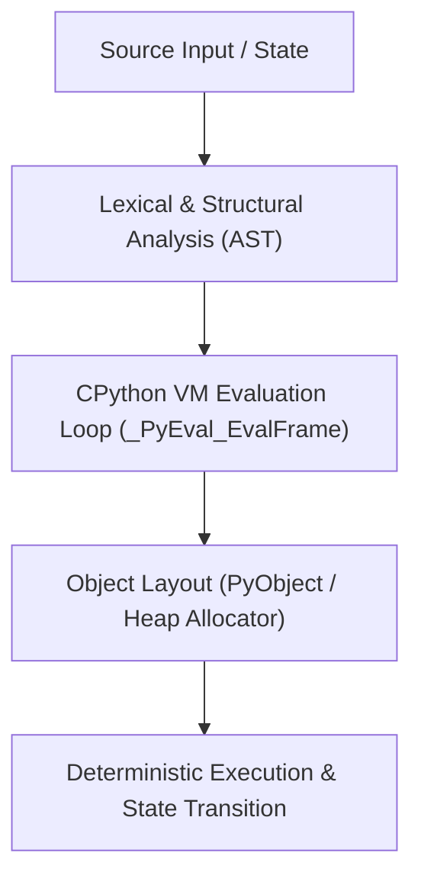

# Mental Model & Architecture



## Chapter 1 — How Python Actually Works

### What You Learned

- Python source code goes through **tokenization → AST → bytecode → execution** before a single instruction runs
- You can inspect each stage using `tokenize`, `ast`, and `dis` from the standard library
- There are three ways to run Python: **script mode**, **REPL**, and **module mode** (`python -m`)
- The `__name__ == "__main__"` guard is essential for files that double as libraries and scripts
- `sys.path` controls where Python searches for modules — understanding it prevents import errors
- **CPython** is the reference implementation; **PyPy** uses JIT compilation for 5–50× speedups on pure Python
- The **GIL** limits CPU-bound threading in CPython; use `multiprocessing` or GIL-free libraries (numpy, torch) for parallelism
- Virtual environments isolate project dependencies — always use one per project
- Python's introspection tools (`inspect`, `sys`, `dis`, `gc`) let you examine the interpreter's live state

### Key Concepts

| Concept | Description |
|---------|-------------|
| Bytecode | Intermediate representation compiled from Python source, executed by the PVM |
| AST | Abstract Syntax Tree — the structured parse of your source code |
| `__name__` | `"__main__"` when run directly, the module name when imported |
| `sys.path` | List of directories Python searches for modules |
| GIL | Global Interpreter Lock — prevents true CPU-bound threading in CPython |
| Virtual Environment | Isolated Python + packages directory per project |
| `site-packages` | Directory where `pip` installs packages |
| Reflection | The ability of a program to inspect and modify itself at runtime |

### Mental Models to Keep

```text
Source code → Tokenize → AST → Bytecode → PVM → Result

CPython (interpreted) vs PyPy (JIT-compiled) vs Cython (compiled to C)

sys.path search order: current dir → PYTHONPATH → stdlib → site-packages
```

### Common Traps

- Running `python script.py` vs `python -m package.script` behaves differently with `sys.path`
- `sys.getrefcount(x)` returns the count **plus 1** for the function call itself
- Threading doesn't speed up CPU-bound Python code because of the GIL
- Forgetting `if __name__ == "__main__":` causes code to run on import

### Interview Takeaways

- "What happens when you type `python hello.py`?" → Full pipeline: read → tokenize → parse → compile → execute
- "What is the GIL?" → Mutex protecting CPython's reference counts; allows only one thread to run bytecode at a time
- "How does `import` work?" → Python searches `sys.path` for the module, compiles and caches it in `__pycache__`, then returns the module object
- "Difference between CPython and PyPy?" → CPython interprets bytecode; PyPy JIT-compiles hot paths to native code

### Before Moving On

Check that you can confidently answer:

- □ I can explain the full pipeline from `.py` file to executed instructions
- □ I can inspect bytecode using `dis.dis()` and read what `LOAD_FAST` / `BINARY_OP` do
- □ I understand why `if __name__ == "__main__":` is needed and how `__name__` changes
- □ I can create a virtual environment, activate it, and install packages into it
- □ I understand what `sys.path` contains and in what order Python searches it
- □ I can use `inspect.signature()` to view a function's parameters at runtime