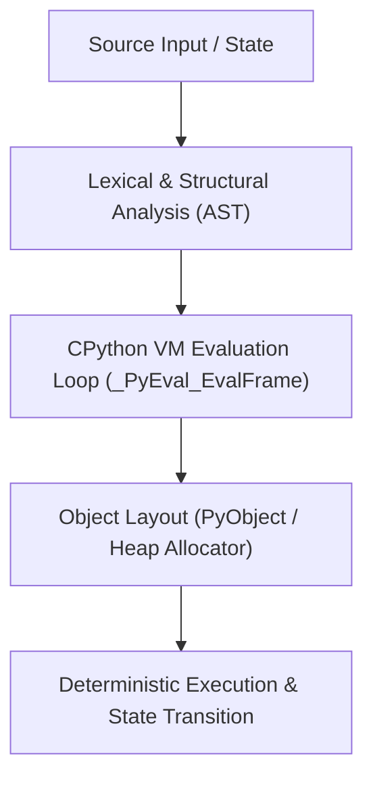

# Mental Model & Architecture



## Chapter 2 — Variables, Objects & Memory

### What You Learned

- Python variables are **names** bound to **objects** — not boxes containing values
- Every Python object has three properties: **identity** (`id()`), **type** (`type()`), **value**
- `id()` returns the memory address in CPython; two live objects always have different ids
- `is` tests **identity** (same object); `==` tests **value equality** (calls `__eq__`)
- Only use `is` with singletons: `None`, `True`, `False`, or deliberate aliasing checks
- **Aliasing** occurs when multiple names point to the same object — mutation propagates!
- **Shallow copy** creates a new container but aliases the elements; **deep copy** is fully independent
- **Mutable** objects (list, dict, set) can change value in place; **immutable** objects (int, str, tuple) cannot
- Only **hashable** (generally immutable) objects can be dict keys or set elements
- CPython uses **reference counting**: each object has `ob_refcnt`; when it hits 0, the object is freed immediately
- **Circular references** prevent refcount from reaching 0; Python's **cyclic GC** handles these
- `del` removes a name binding; the object is freed only when all references are gone
- Memory leaks in Python are typically **retention leaks**: objects kept alive longer than intended
- Tools for diagnosing leaks: `tracemalloc`, `objgraph`, `memory_profiler`, `pympler`

### Key Concepts

| Concept | Description |
|---------|-------------|
| Name binding | `x = obj` adds `"x" → ref` to the current namespace dict |
| Identity | `id(obj)` — unique integer per object, reused after object death |
| `is` vs `==` | Identity (same object) vs Value equality (same content) |
| Aliasing | Multiple names pointing to the same object |
| Shallow copy | New container, shared element references |
| Deep copy | Fully independent recursive copy |
| Mutability | Whether object value can change in place |
| Hashability | Whether object can be a dict key (requires stable hash) |
| Reference count | `ob_refcnt` field tracking how many references point to an object |
| Cyclic GC | Three-generation mark-sweep for circular references |
| Weak reference | Reference that doesn't increment refcount |

### Memory Model Diagram

```text
Namespace (dict):
  "x" → ref ──────────────────────→ PyObject in heap:
  "y" → ref ──────────────────────→   ob_refcnt: 2
                                       ob_type: *list
                                       data: [ref1, ref2, ref3]
                                               ↓     ↓     ↓
                                           int(1) int(2) int(3)
```

### Common Traps

- `a is b` may be True for small integers (caching artifact) — always use `==` for values
- `b = a` followed by `b.append(x)` mutates `a` too — they alias the same list
- `[[0]*3]*3` creates three aliases to the same row — use `[[0]*3 for _ in range(3)]`
- `+=` on a list mutates in place; `+=` on an int creates a new object
- `del x` only removes the name; the object lives until all references are gone
- Storing `sys.exc_info()` captures the entire frame including all local variables

### Interview Takeaways

- "What is the difference between `is` and `==`?" → identity vs value equality; `==` calls `__eq__`; `is` is pointer comparison
- "What is reference counting?" → CPython's primary memory strategy; `ob_refcnt`; zero → immediate deallocation
- "Why can't lists be dictionary keys?" → lists are mutable → unhashable; a mutable key's hash could change after insertion
- "What is a shallow vs deep copy?" → shallow copies container only; deep copies recursively
- "How does Python detect circular references?" → cyclic GC; generational mark-sweep runs periodically
- "What is aliasing?" → multiple names referring to the same object; mutation visible through all aliases

### Before Moving On

- □ I can draw a memory diagram showing names, references, and objects on the heap
- □ I know when to use `is` (None/True/False only) vs `==` (all value comparisons)
- □ I can explain why `b = a; b.append(4)` changes `a`
- □ I understand shallow copy vs deep copy and when each is appropriate
- □ I know which types are mutable/immutable and which are hashable
- □ I can explain what `ob_refcnt` is and how Python uses it
- □ I can create a circular reference and verify it's collected by `gc.collect()`
- □ I can use `tracemalloc` to find which line of code is growing memory