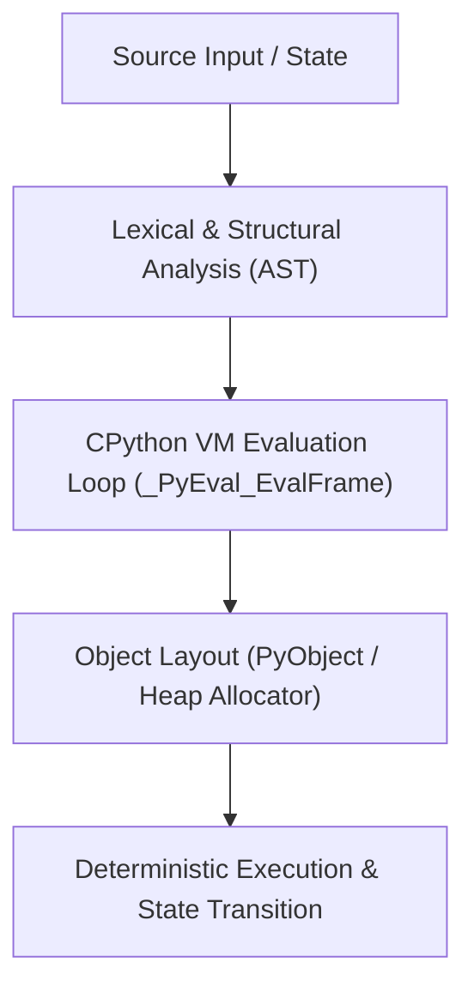

# Mental Model & Architecture



## Chapter 3 — Numbers, Strings & Booleans

### What You Learned

- Python integers are **arbitrary-precision** — no overflow, but with memory overhead (28+ bytes per int)
- CPython caches integers **-5 to 256** as singletons — the Flyweight pattern
- Python floats are **IEEE 754 64-bit doubles** — most decimal fractions cannot be represented exactly
- `0.1 + 0.2 != 0.3` — always use `math.isclose()` or `numpy.allclose()` for float comparison
- NaN is the most dangerous value: `nan != nan`, NaN propagates silently through computation
- ML uses different float types: `float32` (standard), `float16` (limited range), `bfloat16` (same range as float32, less precision)
- Python strings are **immutable sequences of Unicode code points** — not bytes
- Encoding (`str → bytes`) and decoding (`bytes → str`) require explicit encoding specification
- UTF-8 is the universal encoding — variable-length (1–4 bytes per character)
- String `+` in a loop is O(n²) — always use `"".join(parts)` for building strings
- `bool` is a **subclass of `int`**: `True == 1`, `False == 0`; every object has a boolean value (truthiness)
- `and`/`or` return the actual operands (not bools) and use **short-circuit evaluation**
- CPython **interns** identifier-like strings for fast dictionary key lookups

### Key Concepts

| Concept | Description |
|---------|-------------|
| Arbitrary precision int | Python ints can be arbitrarily large; stored as arrays of 30-bit digits |
| Integer cache | CPython pre-allocates ints -5 to 256 as singletons |
| IEEE 754 double | 64-bit float; 52-bit mantissa + 11-bit exponent + sign |
| Float comparison | Never use `==`; use `math.isclose()` or `abs(a-b) < tol` |
| NaN | Not-a-Number; not equal to anything including itself |
| Unicode | Text standard with code points for every character |
| UTF-8 | Variable-length encoding: 1–4 bytes/character |
| Encoding/Decoding | `str.encode()` → `bytes`; `bytes.decode()` → `str` |
| Truthiness | Every Python object is truthy or falsy |
| Short-circuit | `and`/`or` stop evaluating once result is determined |
| String interning | CPython deduplicates identifier-like string literals |

### Float Precision Reference

```text
float64 (Python float): ~15 decimal digits, range ±1.8×10³⁰⁸
float32 (numpy/torch):  ~7 decimal digits,  range ±3.4×10³⁸
float16 (half):          ~3 decimal digits,  range ±65504
bfloat16:               ~2 decimal digits,  range ±3.4×10³⁸  (same as float32)
```

### Truthiness Table

| Value | Truthiness |
|-------|-----------|
| `None` | Falsy |
| `False`, `0`, `0.0`, `0j` | Falsy |
| `""`, `b""`, `[]`, `()`, `{}`, `set()` | Falsy |
| `range(0)` | Falsy |
| Everything else | Truthy |

### Common Traps

- `0.1 + 0.2 == 0.3` is `False` — floating-point precision
- `bool("False")` is `True` — non-empty string
- `a = 257; b = 257; a is b` may be False — outside int cache
- `True + True == 2` and `True == 1` — bool is a subclass of int
- `"hello world" is "hello world"` may be False — not interned
- Building strings with `+=` in loops is O(n²) — use `join()`
- `len("🐍") == 1` but `len("🐍".encode('utf-8')) == 4` — code points vs bytes

### Interview Takeaways

- "Does Python have integer overflow?" → No. Python ints are arbitrary-precision
- "Why does `0.1 + 0.2 != 0.3`?" → IEEE 754 binary representation; 0.1 is not exactly representable in binary
- "What is the small integer cache?" → CPython pre-allocates ints -5 to 256; using `is` on these returns True even for "separate" variables
- "What is string interning?" → CPython deduplicates identifier-like strings; same object for multiple variables with the same string value
- "What is truthiness?" → Every Python object evaluates to True or False in boolean context; defined by `__bool__` or `__len__`
- "What is the difference between `str` and `bytes`?" → str is Unicode code points; bytes is raw byte data; encode/decode converts between them

### Before Moving On

- □ I can explain why Python integers don't overflow
- □ I understand IEEE 754 and can explain why `0.1 + 0.2 != 0.3`
- □ I know to use `math.isclose()` for float comparison
- □ I can explain what NaN is and why `nan != nan`
- □ I understand the difference between Unicode code points and UTF-8 bytes
- □ I can encode and decode strings between str and bytes
- □ I understand Python's truthiness rules and can list falsy values
- □ I can explain short-circuit evaluation in `and`/`or`
- □ I know the small integer cache range (-5 to 256) and its implications