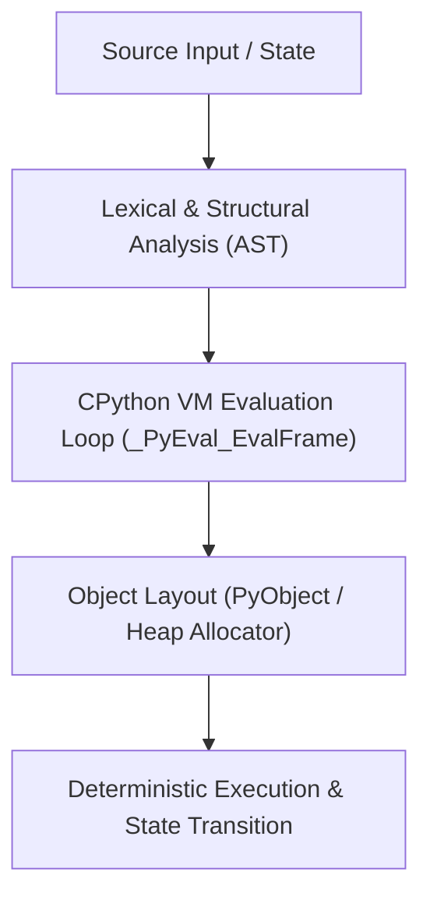

# Mental Model & Architecture

## Chapter 4 — Lists & Dynamic Arrays

### What You Learned
- CPython lists are **dynamic arrays of pointer references** (`PyListObject`), not linked lists.
- Element lookup (`lst[i]`) is O(1) via pointer arithmetic: `ob_item + i * sizeof(PyObject*)`.
- Append is **amortized O(1)** due to geometric over-allocation: `allocated = size + (size >> 3) + (size < 9 ? 3 : 6)`.
- Prepending (`lst.insert(0, val)`) or popping from the left (`lst.pop(0)`) is O(n) as all subsequent pointers shift.
- Slicing (`lst[a:b]`) creates a **new shallow copy** of length `b - a`.
- List comprehensions execute in a dedicated C-level frame, executing `LIST_APPEND` opcodes directly without repeated method lookup.
- Timsort is an adaptive, stable O(n log n) sorting algorithm designed around real-world "runs" of monotonic sequences.

### Common Traps
- `[[0] * 3] * 3` creates three references to the *exact same* inner list object.
- Modifying a list during iteration produces silent index skips.

### AI Connection
In PyTorch and TensorFlow, native Python lists introduce severe pointer indirection and GC overhead. PyTorch tensors store flat, contiguous memory buffers directly mapped to CUDA streams without object headers.
