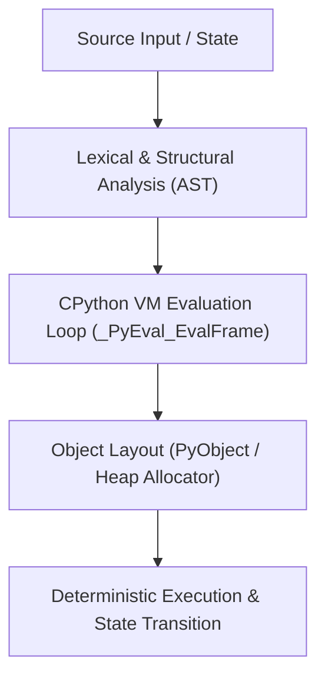

# Mental Model & Architecture

## Chapter 5 — Tuples & Immutability

### What You Learned
- `PyTupleObject` is a fixed-size, immutable sequence stored in contiguous memory without overallocation.
- Tuples have lower memory overhead than lists because `ob_size == allocated` always.
- CPython maintains a free list of empty and small tuples up to length 20 to avoid repeated heap allocation.
- A tuple is only **hashable** if *every element* it contains is also hashable.
- `namedtuple` and `typing.NamedTuple` provide struct-like record semantics with zero memory overhead over regular tuples.

### Common Traps
- `(42)` is an integer in parentheses; `(42,)` is a single-element tuple.
- Mutating a list *inside* an immutable tuple `t = ([], 1); t[0].append(99)` succeeds even though `t[0] = ...` fails with `TypeError`.
