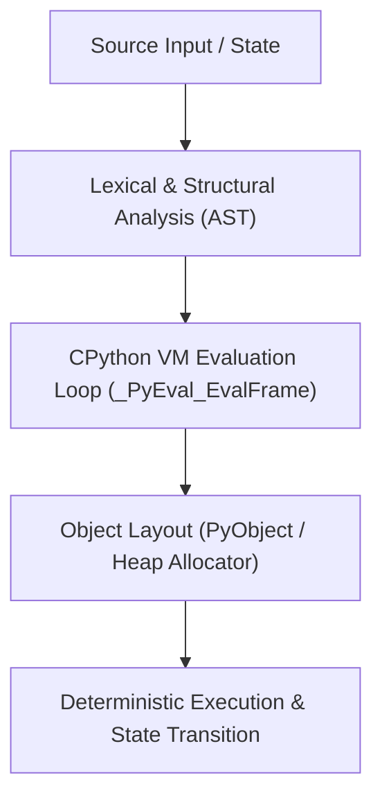

# Mental Model & Architecture

## Chapter 6 — Dictionaries & Hash Tables

### What You Learned
- `PyDictObject` uses an optimized **compact hash table layout** (since Python 3.6/PEP 468) that preserves insertion order.
- The layout splits storage into a sparse `indices` array and a dense `entries` array: `[hash, key_ptr, value_ptr]`.
- Open addressing with pseudo-random perturbation probing `probe = (5 * probe + 1 + perturb) & mask` resolves collisions.
- Dict resizing occurs when the load factor exceeds 2/3, quadrupling capacity (or doubling for large dicts).
- Key lookup is O(1) average: computes `hash(key)`, probes `indices`, verifies identity (`key is entry.key`) or equality (`key == entry.key`).

### AI Connection
In LLM systems, token vocabulary mappings (`token2id` / `id2token`), KV cache indices, and embedding lookup tables are modeled around constant-time hash table access patterns.
