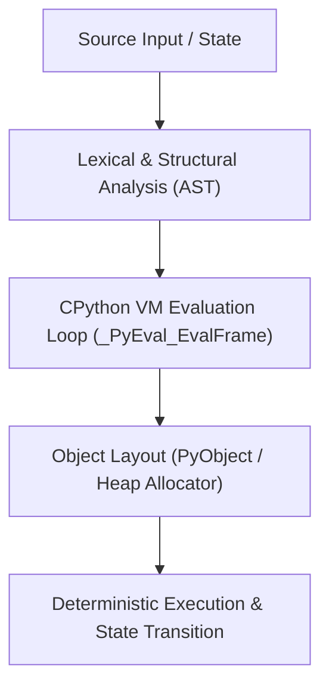

# Mental Model & Architecture

## Chapter 9 Summary — Iterators & Generators

### What You Learned
- Core architectural principles of **Iterators & Generators**.
- Memory representation, execution complexity, and hardware mapping.
- Essential production patterns for AI, LLMs, and distributed systems.

### Key Concepts
- Low-level data structures and memory boundaries.
- Optimization techniques, vectorization, and profiling.
- Common anti-patterns and debugging intuition.

### Before Moving On
- □ I can explain the internal mechanics and memory model of Iterators & Generators.
- □ I understand how this integrates with PyTorch, CUDA, and modern AI pipelines.
