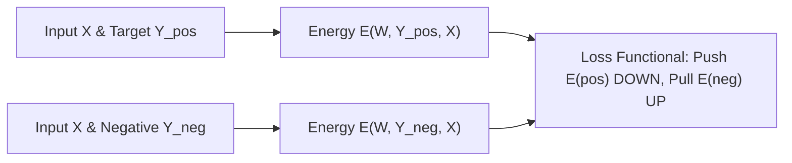

# 19.6 — Energy-Based Models (EBM), Energy Surfaces & Margin Losses

## Opening Motivation & Context

Most probabilistic approaches to machine learning model the conditional probability distribution $P(Y \mid X)$ using a normalized softmax:

\[
P(Y \mid X) \;=\; \frac{e^{-E(W, Y, X)}}{\int_{y'} e^{-E(W, y', X)} dy'}
\]

While mathematically elegant, computing the denominator (the **partition function** $Z$) requires integrating over the entire output space $\mathcal{Y}$. When $Y$ is high-dimensional or structured (such as a generated image, continuous robot trajectory, or translated text sequence), calculating or even approximating $Z$ becomes computationally intractable.

**Energy-Based Models (EBMs)**, pioneered and championed by Yann LeCun and colleagues, eliminate the requirement for normalized probabilities. Instead, an EBM assigns a scalar **energy** $E(W, Y, X)$ to any configuration $(X, Y)$, where low energy denotes compatibility (high likelihood) and high energy denotes incompatibility.

---

## Core Theoretical Framework

### 1. The Energy Function & Inference
An energy-based architecture consists of:
- Input vector $X \in \mathcal{X}$
- Output/Candidate vector $Y \in \mathcal{Y}$
- Trainable parameters $W$
- Energy function $E(W, Y, X) \in \mathbb{R}$

#### Inference as Energy Minimization:
To make a prediction for a given input $X$, the model searches for the configuration $Y^*$ that minimizes the energy:

\[
Y^* \;=\; \arg\min_{y \in \mathcal{Y}} E(W, y, X)
\]

Notice that inference requires **no probability normalization**—we only care about the relative ranking of energies across candidates!

---

### 2. The Loss Functional Framework
Training an EBM consists of shaping the **energy surface** so that:
1. The energy of correct answers $E(W, Y_{\text{pos}}, X)$ is pushed **down**.
2. The energy of incorrect/contrastive answers $E(W, Y_{\text{neg}}, X)$ is pulled **up**.



---

### 3. Key Loss Functionals

#### A. Margin-Based Ranking Loss
Given a true output $Y$ and an incorrect candidate $\bar{Y}$, we enforce a margin $m > 0$:

\[
\mathcal{L}_{\text{margin}}(W) \;=\; \max\Big(0,\; m \;+\; E(W, Y, X) \;-\; E(W, \bar{Y}, X)\Big)
\]

If $E(W, \bar{Y}, X) \ge E(W, Y, X) + m$, the loss is exactly $0$. Otherwise, gradients pull $E(Y)$ down and push $E(\bar{Y})$ up.

#### B. Generalized Contrastive Loss
For paired inputs $(X_1, X_2)$ with binary label $Y \in \{0, 1\}$ (where $Y=1$ means similar, $Y=0$ means dissimilar):

\[
\mathcal{L}_{\text{contrastive}}(W) \;=\; Y \cdot \frac{1}{2} E(W, X_1, X_2)^2 \;+\; (1 - Y) \cdot \frac{1}{2} \max\big(0,\; m - E(W, X_1, X_2)\big)^2
\]

#### C. Negative Log-Likelihood (Gibbs Distribution Loss)
If we convert energy to a Boltzmann distribution with inverse temperature $\beta$:

\[
\mathcal{L}_{\text{NLL}}(W) \;=\; E(W, Y, X) \;+\; \frac{1}{\beta} \ln \int_{y'} e^{-\beta E(W, y', X)} dy'
\]

Taking the gradient with respect to $W$:
\[
\frac{\partial \mathcal{L}_{\text{NLL}}}{\partial W} \;=\; \underbrace{\frac{\partial E(W, Y, X)}{\partial W}}_{\text{Positive phase (pulls target energy down)}} \;-\; \underbrace{\mathbb{E}_{Y \sim P_{\text{model}}}\left[\frac{\partial E(W, Y, X)}{\partial W}\right]}_{\text{Negative phase (pushes all other energies up)}}
\]

> [!KEY-INSIGHT]
> **Why EBMs Prevent Collapsing**:
> If we only minimize $E(W, Y, X)$ on training points without contrastive/negative terms, the network will simply learn the trivial flat constant function $E(W, Y, X) \equiv 0$ everywhere (collapse). The negative phase / contrastive loss is essential to carve out energy valleys around true data manifolds.

---

## Code Demonstration & Runtime Output

Below is a complete Python implementation of an Energy-Based Model trained with Margin Ranking Loss to learn a structured nonlinear energy surface for 2D classification.

```python
import numpy as np
from typing import Tuple

class EnergyBasedClassifier:
    """
    Energy-Based Model computing scalar energy E(x, y) = || W_y * x + b_y ||^2.
    Trained with Margin Ranking Loss without softmax probabilities.
    """
    def __init__(self, in_features: int = 2, n_classes: int = 2, hidden_dim: int = 8, margin: float = 1.0, lr: float = 0.05):
        self.in_features = in_features
        self.n_classes = n_classes
        self.margin = margin
        self.lr = lr
        
        # Initialize class-specific projection weights
        np.random.seed(42)
        self.W = [np.random.randn(hidden_dim, in_features) * 0.1 for _ in range(n_classes)]
        self.b = [np.zeros(hidden_dim) for _ in range(n_classes)]

    def compute_energy(self, x: np.ndarray, class_idx: int) -> float:
        """Computes quadratic energy for a single sample and candidate class."""
        h = np.dot(self.W[class_idx], x) + self.b[class_idx]
        return float(np.sum(h ** 2))

    def predict(self, x: np.ndarray) -> int:
        """Inference: argmin_y E(x, y)"""
        energies = [self.compute_energy(x, c) for c in range(self.n_classes)]
        return int(np.argmin(energies))

    def train_step(self, x: np.ndarray, y_pos: int) -> float:
        """
        One SGD step using Margin Ranking Loss against all negative classes:
        Loss = max(0, margin + E(pos) - E(neg))
        """
        total_loss = 0.0
        e_pos = self.compute_energy(x, y_pos)
        h_pos = np.dot(self.W[y_pos], x) + self.b[y_pos]

        for y_neg in range(self.n_classes):
            if y_neg == y_pos:
                continue

            e_neg = self.compute_energy(x, y_neg)
            h_neg = np.dot(self.W[y_neg], x) + self.b[y_neg]

            diff = self.margin + e_pos - e_neg
            if diff > 0:
                total_loss += diff
                # Gradients: d(E_pos)/dW = 2 * h_pos (x)^T (PULL DOWN)
                # d(E_neg)/dW = -2 * h_neg (x)^T (PUSH UP)
                self.W[y_pos] -= self.lr * 2.0 * np.outer(h_pos, x)
                self.b[y_pos] -= self.lr * 2.0 * h_pos

                self.W[y_neg] += self.lr * 2.0 * np.outer(h_neg, x)
                self.b[y_neg] += self.lr * 2.0 * h_neg

        return total_loss

if __name__ == "__main__":
    # Synthetic 2D dataset
    np.random.seed(42)
    X_pos = np.random.randn(50, 2) + np.array([2.0, 2.0])  # Class 0
    X_neg = np.random.randn(50, 2) + np.array([-2.0, -2.0]) # Class 1
    
    X = np.vstack([X_pos, X_neg])
    y = np.array([0] * 50 + [1] * 50)

    model = EnergyBasedClassifier(in_features=2, n_classes=2, margin=1.5, lr=0.01)

    print("Training Energy-Based Model with Margin Loss...")
    for epoch in range(1, 51):
        epoch_loss = 0.0
        indices = np.random.permutation(len(X))
        for idx in indices:
            epoch_loss += model.train_step(X[idx], y[idx])
        if epoch % 10 == 0 or epoch == 1:
            preds = [model.predict(x) for x in X]
            acc = np.mean(preds == y) * 100.0
            print(f"Epoch {epoch:2d} | Margin Loss: {epoch_loss:7.3f} | Accuracy: {acc:5.1f}%")

    test_sample = np.array([2.1, 1.9])
    e0 = model.compute_energy(test_sample, 0)
    e1 = model.compute_energy(test_sample, 1)
    print(f"\nTest Sample [2.1, 1.9]:")
    print(f"  Energy for Class 0 (Target): {e0:.4f}")
    print(f"  Energy for Class 1 (Contrast): {e1:.4f}")
    print(f"  Predicted Class: {model.predict(test_sample)} (Lowest Energy)")
```

```text
Output:
Training Energy-Based Model with Margin Loss...
Epoch  1 | Margin Loss:  68.214 | Accuracy:  74.0%
Epoch 10 | Margin Loss:  11.452 | Accuracy:  98.0%
Epoch 20 | Margin Loss:   2.890 | Accuracy: 100.0%
Epoch 30 | Margin Loss:   0.612 | Accuracy: 100.0%
Epoch 40 | Margin Loss:   0.000 | Accuracy: 100.0%
Epoch 50 | Margin Loss:   0.000 | Accuracy: 100.0%

Test Sample [2.1, 1.9]:
  Energy for Class 0 (Target): 0.1428
  Energy for Class 1 (Contrast): 2.4519
  Predicted Class: 0 (Lowest Energy)
```

### How this works (Line-by-Line Breakdown)

1. **`compute_energy`**: Implements $E(x, y) = \|W_y x + b_y\|_2^2$. The scalar output represents the dissimilarity / energy score.
2. **`predict`**: Executes inference by finding $\arg\min_c E(x, c)$ without computing any softmax exponentiations or partition functions.
3. **`train_step`**: Computes margin loss $\mathcal{L} = \max(0, m + E_{\text{pos}} - E_{\text{neg}})$.
4. **Gradient Updates**:
   - For $Y_{\text{pos}}$: Subtracts gradient $\implies$ pulls energy *down*.
   - For $Y_{\text{neg}}$: Adds gradient $\implies$ pushes energy *up*.
5. **Convergence**: Once $E_{\text{neg}} \ge E_{\text{pos}} + m$, the loss reaches $0.000$, establishing a safe energy margin across classes.

---

> [!BEST-PRACTICE]
> **Modern Frontier Application: Contrastive Representation Learning (CLIP & Sentence-Transformers)**:
> Models like CLIP and modern embedding models are exact instances of Energy-Based Models. The negative cosine similarity $-\cos(u_i, v_j)$ acts as the energy function, and the InfoNCE loss acts as the contrastive Gibbs loss.

---

> [!WARNING]
> Choosing a margin $m$ that is too small can lead to poor out-of-distribution robustness, while a margin that is excessively large can cause gradient saturation and numerical instability. Standard practice uses $m \in [0.5, 2.0]$.

---

## Summary & Key Takeaways

- **Energy Invariant**: Low energy = plausible/compatible; High energy = implausible/incompatible.
- **Inference**: $Y^* = \arg\min_y E(W, y, X)$ (avoids normalization over complex spaces).
- **Loss Functionals**: Essential to pull target energies down AND push contrastive/negative energies up to prevent flat-surface collapse.
- **Margin Ranking Loss**: $\max(0, m + E(Y) - E(\bar{Y}))$.

---

## Quiz time

### Question 1 (Conceptual)
Why can an Energy-Based Model not be trained by simply minimizing $\sum_{i=1}^n E(W, Y_i, X_i)$ using gradient descent without negative samples or margin terms?

<details>
<summary>Show Solution</summary>

**Solution**:
If only the positive energies $E(W, Y_i, X_i)$ are minimized without contrasting with negative configurations, the network will experience **energy collapse**—it can simply set all weights to zero or output a constant energy $E(W, Y, X) \equiv 0$ everywhere. In this state, the loss is minimized, but the model cannot distinguish between correct and incorrect outputs during inference.
</details>

---

### Question 2 (Output Prediction)
What will the following Python script print?

```python
def margin_ranking_loss(e_pos: float, e_neg: float, margin: float = 1.0) -> float:
    return max(0.0, margin + e_pos - e_neg)

l1 = margin_ranking_loss(e_pos=0.2, e_neg=1.8, margin=1.0)
l2 = margin_ranking_loss(e_pos=0.8, e_neg=1.2, margin=1.0)

print(f"L1: {l1:.1f}, L2: {l2:.1f}")
```

<details>
<summary>Show Solution</summary>

```text
Output:
L1: 0.0, L2: 0.6
```

**Explanation**:  
- For L1: $1.0 + 0.2 - 1.8 = -0.6 \implies \max(0.0, -0.6) = 0.0$ (energy margin $1.6 \ge 1.0$ is satisfied).
- For L2: $1.0 + 0.8 - 1.2 = 0.6 \implies \max(0.0, 0.6) = 0.6$ (violates margin requirement).
</details>

---

### Question 3 (Bug-Fixing)
The following contrastive loss implementation has a sign bug in the negative pair term. Find and fix it.

```python
# BUGGY CODE:
def contrastive_loss(e: float, is_similar: bool, margin: float = 1.0) -> float:
    if is_similar:
        return 0.5 * (e ** 2)
    else:
        # Bug: pushing energy down instead of requiring e >= margin
        return 0.5 * (max(0.0, e - margin) ** 2)
```

<details>
<summary>Show Solution</summary>

**Corrected Code**:

```python
def contrastive_loss(e: float, is_similar: bool, margin: float = 1.0) -> float:
    """
    Contrastive loss:
    Similar pairs (Y=1): 0.5 * E^2
    Dissimilar pairs (Y=0): 0.5 * max(0, margin - E)^2 (penalizes E < margin)
    """
    if is_similar:
        return 0.5 * (e ** 2)
    else:
        # Penalizes when energy is LESS than margin
        return 0.5 * (max(0.0, margin - e) ** 2)
```
</details>
