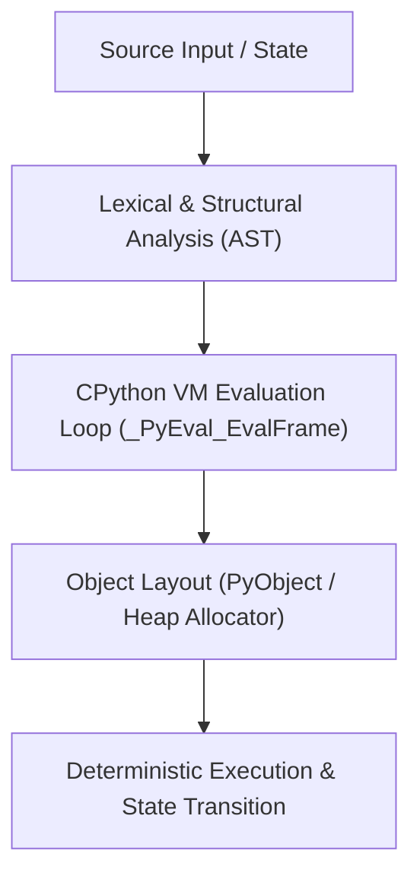

# Mental Model & Architecture

## Chapter 54 Summary — LLM Serving Engines (vLLM & TGI)

### What You Learned
- Core mathematical principles and architectural layout of **LLM Serving Engines (vLLM & TGI)**.
- In-depth memory models, strided pointers, computation graphs, and kernel dispatches.
- Production optimization techniques for AI, PyTorch, and distributed training.

### Key Concepts
- Low-level data structures and zero-copy transformations.
- Execution complexity, hardware acceleration, and profiling.
- Common anti-patterns, numerical stability, and debugging.

### Before Moving On
- □ I can explain the low-level data structures and execution flow of LLM Serving Engines (vLLM & TGI).
- □ I understand how this connects to PyTorch autograd, CUDA VRAM, and modern LLM pipelines.
